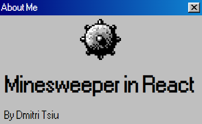
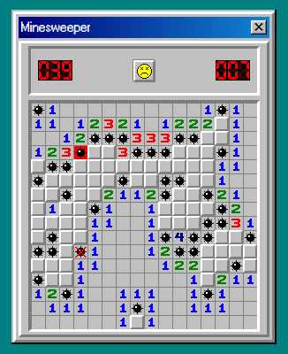

# Minesweeper in React

This is a project wri   tten for the internship contest at VK. Around 10 hours total was 
spent on making this project from scratch.

I tried making this project as authentic as possible by using old school fonts and classic Win98 icons, 
replicating the style of Win98 with CSS.

Stuff used for this project:
- TypeScript
- Webpack
- React
- Redux
- React Router

## Available Scripts

In the project directory, you can run:

### `npm start`

Runs the app in the development mode.\
Open [http://localhost:3000](http://localhost:3000) to view it in the browser.

The page will reload if you make edits.\
You will also see any lint errors in the console.

### `npm run build`

Builds the app for production to the `build` folder.\
The build is minified and the filenames include the hashes.